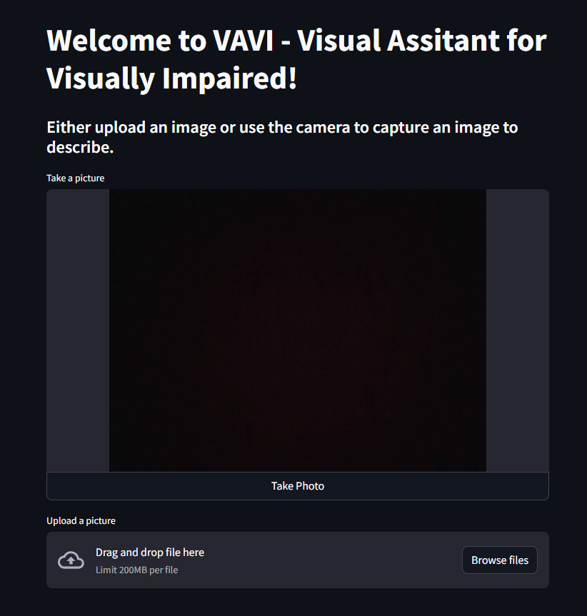

## VAVI (Visual Assistant for Visually Impaired)

This small project is utilizing LLaVA (Large Language-and-Vision Assistant)
model + a camera + a speech synthesizer to process images and help blind / visually impaired individuals
to understand their contents.
To avoid costs, all the components are run offline.

## Components
1. LLaVA
Combines a LLM + visual encoder and an additional projection matrix to process image (+ text) prompts.
LlamaCpp library is used for this one.
2. Streamlit
A Python library useful in creating interactive UIs. The created Streamlit app
gives the option to either upload a file (an image) or take a picture using the device's camera.
It then uses the LLaVA model to describe the image (using a basic prompt 'Describe the following image')
and converts the explanation to a wav file, playable in the browser.

3. TTS
The Text-To-Speech model is used to convert the answer into speech.
MMS-TTS (Massively Multilingual Speech TTS) is used, a model created by Meta.

## How to run
1. Create a virtual environment add install the required dependencies
`pip install -r requirements.txt`
2. Download LLaVa model and the special projection matrix. Depending on your device's capabilities,
select either the 7B or 13B parameters model, using huggingface-cli (and install it before if you don't have it):
- 7B model:\
`huggingface-cli download jartine/llava-v1.5-7B-GGUF llava-v1.5-7b-Q4_K.gguf --local-dir . --local-dir-use-symlinks False`\
`huggingface-cli download jartine/llava-v1.5-7B-GGUF llava-v1.5-7b-mmproj-f16.gguf --local-dir . --local-dir-use-symlinks False`
- 13B model:\
`huggingface-cli download PsiPi/liuhaotian_llava-v1.5-13b-GGUF llava-v1.5-13b-Q5_K_M.gguf --local-dir . --local-dir-use-symlinks False`\
`huggingface-cli download PsiPi/liuhaotian_llava-v1.5-13b-GGUF mmproj-model-f16.gguf --local-dir . --local-dir-use-symlinks False`

3. Run the streamlit app using `streamlit run .\streamlit_app.py`. It should automatically open the app in the default browser.

## Future improvements
1. Extract more information about the elements from the image (e.g.: if it's a list of ingredients, specify what foods could be prepared from those)
2. Create a more user-friendly UI (e.g.: a chatbot that can help the user further)

## Resources:
Main inspiration was from this wonderful blog post by Dmitrii Eliuseev (https://towardsdatascience.com/a-weekend-ai-project-making-a-visual-assistant-for-people-with-vision-impairments-df0b9f0b8c23)

